# 极卫星2015自用评测

2015-07-12 12:42
在这个资讯完全网络化的时代，WIFI已经普遍到了一种难以想象的地步，也孕育了太多的商机。WIFI的先关产品也在这几年扩展壮大，D君L君早已经不是数码城唯有的品牌。当然中间品牌有它存在的底气，国产山寨也有它存在的意义。我们就来看下这次的主角：极卫星2015 无线WiFi放大器的存在意义是什么？

极卫星出自北京极科极客科技有限公司，前期产品是路由器+卫星的组合模式，站内也有值友晒单：极路由 极壹S 无线路由器 + 极卫星 入手体验，评测也相当中肯。

这次的极卫星2015是已中继器的的最新版本登场，号称传输速度提升到300Mbps，相比上代产品速度翻倍。

好吧，开始正题。

Contents：
> ● 产品及细节展示
> ● 安装过程描述
> ● 测试对比
> ● 使用心得总结

## 1.产品及细节展示
老实说从官方图片和描述来说，我一直觉得会是个大家伙（我脑子坏蛋了
），实物是这样的。和Anywhere2比起来，差不多一样大的外箱，当然小也可以理解成精致。

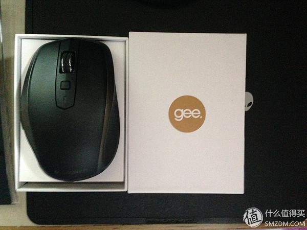

拆开后东西也很少，走的现在流行的风格：主机，电线、说明书

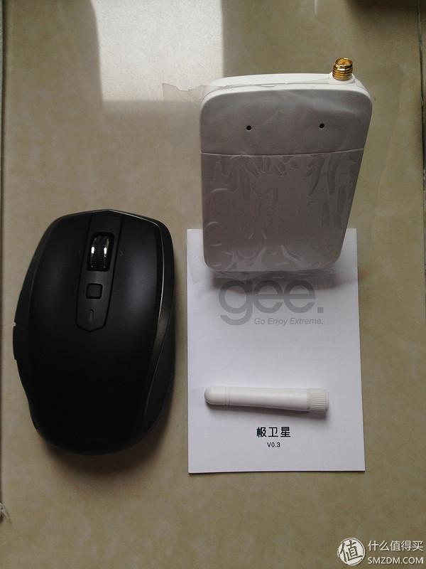

大白的背面特写，主要信息都在上面了，请无视那根不知道哪里来的毛发

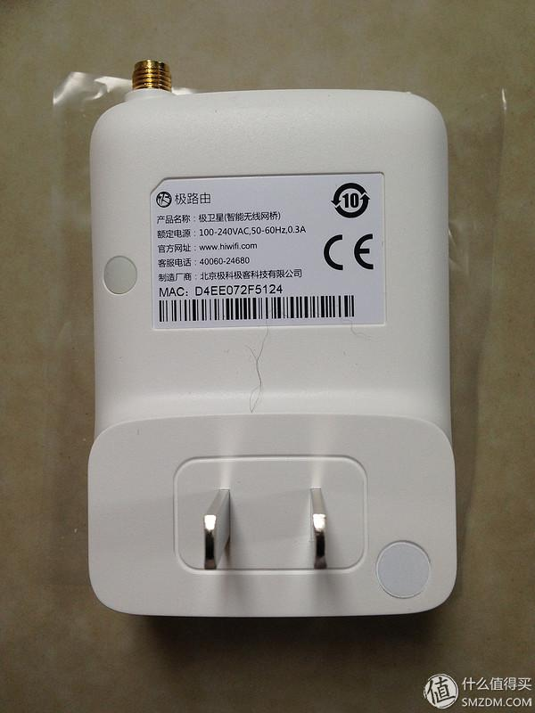

天线孔特写

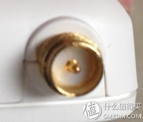

合体照，可以看到正面两颗是状态灯

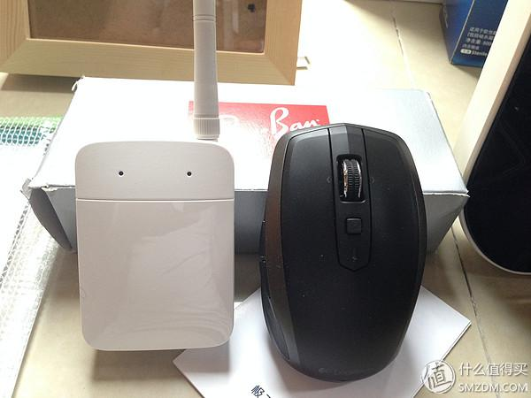

Summary：小，做工尚可，各处缝隙均匀，说明出模和组装还是扎实的。因为正面是高光面，所以手感不错，但是同样因为高光面是很容易划伤的。不过一般谁会拿个中继器到处跑呢？
## 2.安装过程描述
通上电，立即两个提示灯均亮起，红色且闪烁

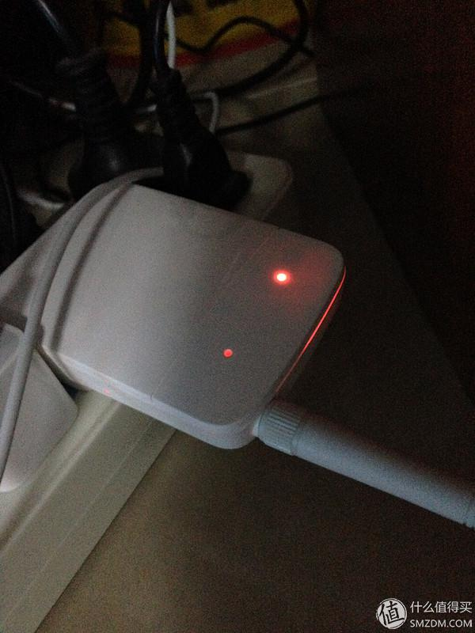

按照说明书提示扫描二维码，或者在APP Store搜索“极路由”，安装软件并打开↓

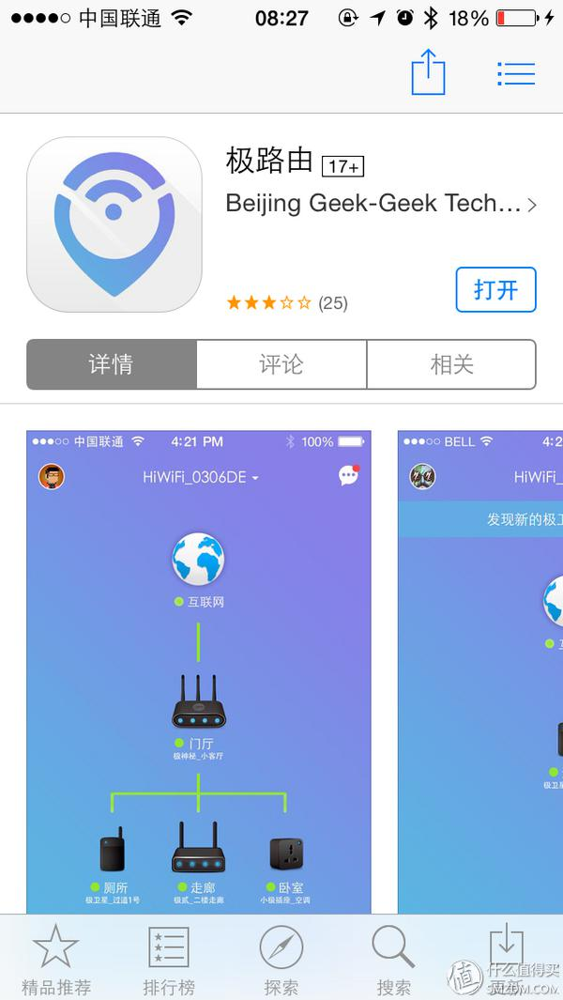

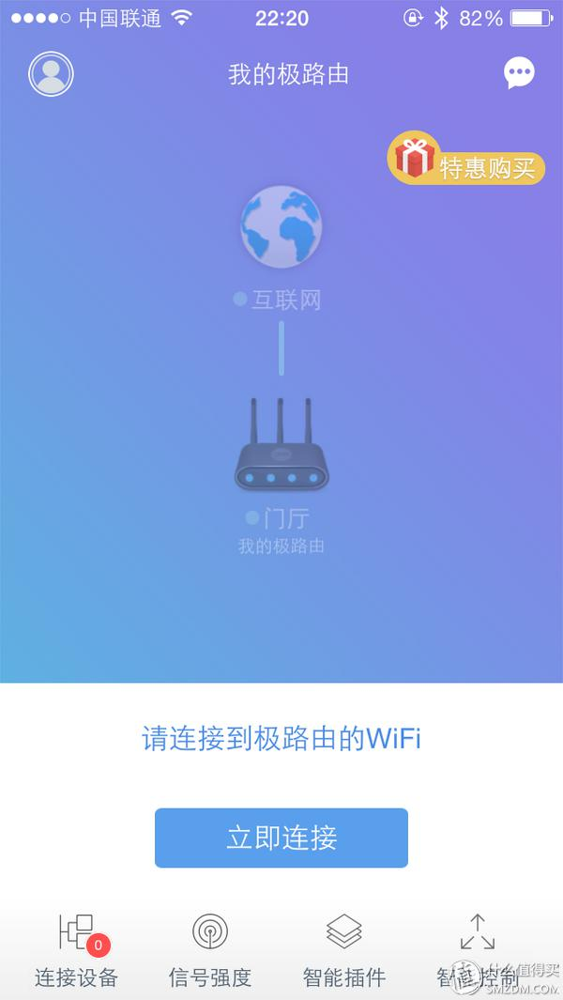

点击“立即连接”，出现对话框提示连接↓

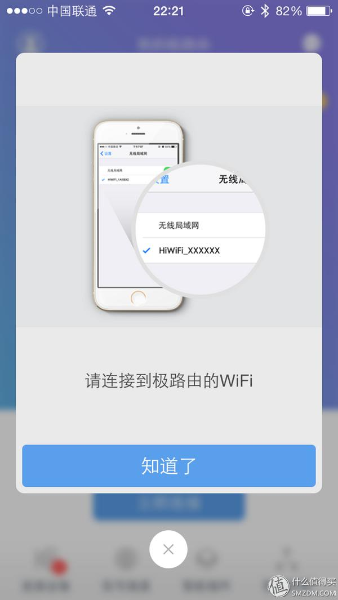

打开WIFI搜索，说明书提示初始名称是以“STARXXXX”来命名的，很容易就连接成功↓

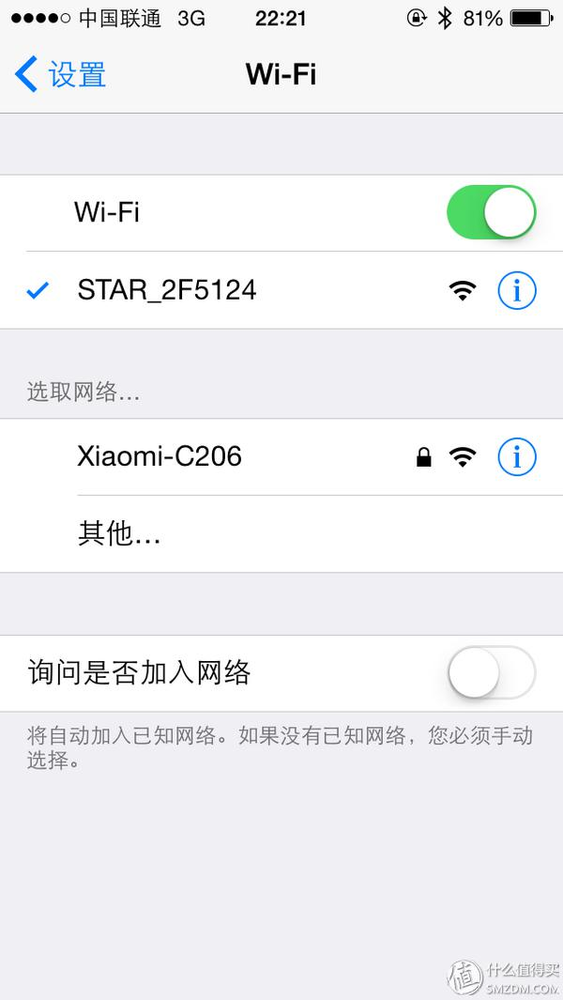

选择主路由器界面↓

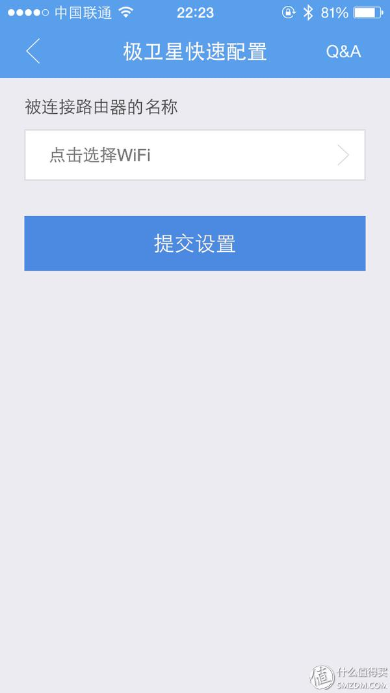

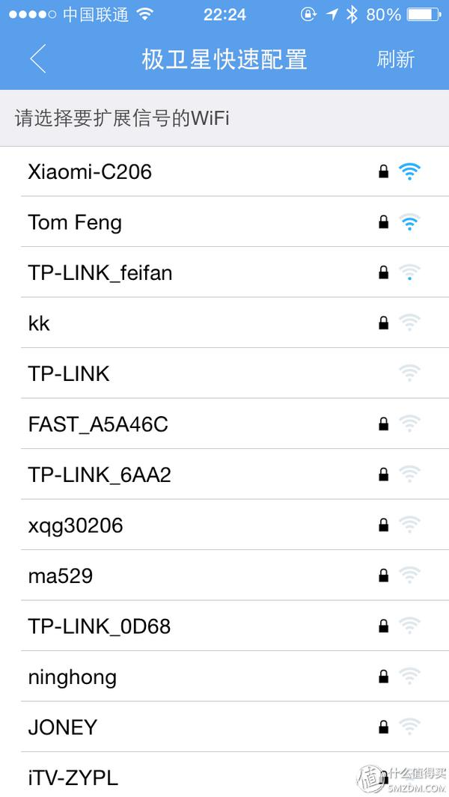

为了和主路由区分开，我将极卫星的名称改写为“SMZDM”↓

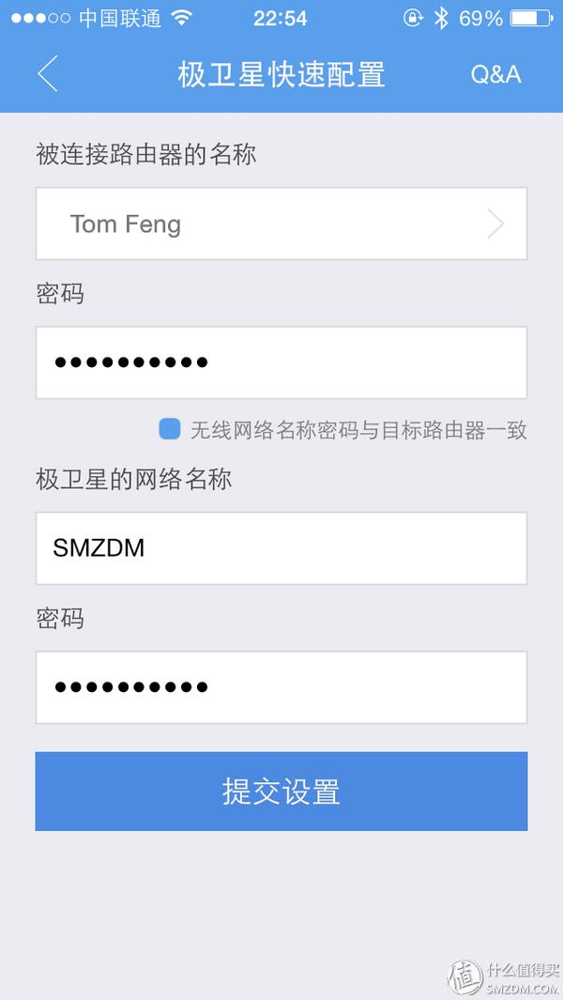

提交设置后软件提示如下↓

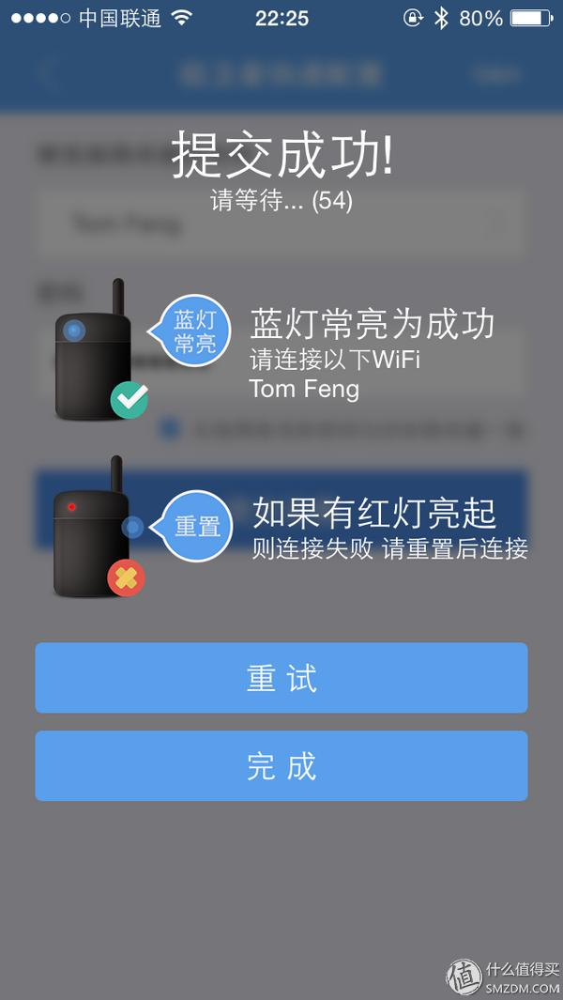

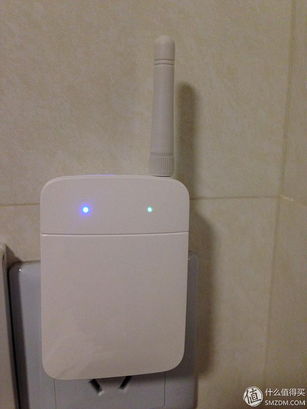

再有，极卫星的右侧面有个小孔，也就是回复初厂孔，使用牙签等物品按压大概5S后抬起，提示灯会显示紫色，而后红色，表示恢复成功↓

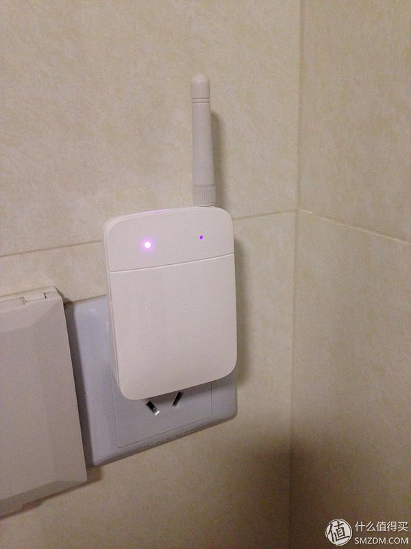

Summary：整个中继连接过程使用APP独立完成，设置中文提示也详细，我相信菜鸟也可以轻松完成。
## 3.测试对比
当然一个中继器的好坏，WIFI的范围和传承主路由的速率才是它的关键所在。我先介绍下测试环境，软件，载体，已经比较产品。
测试环境：135㎡的3居室，中国电信光纤100M
测试点：红色五角星为主路由器位置；蓝色五角星为中继器放置位置；数字符号分别代表5个测试位置（这是我一开始的设想，完全没有从实际出发，这个后面会讲到）。↓

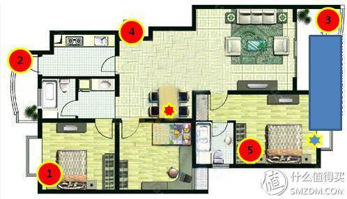

测试载体：IPhone5（ISO8.3 12F70）
测试软件：Speedtest2015 bate3.4.5
使用到的产品：小米路由器（有转作中继器），FAST（三天线），360WIFI3代（中继功能）
关于测试方式，我设计了3种VS方式包括，我简单的做了个表格，希望大家能看懂↓
好了我们一个个来看

### 测试1：

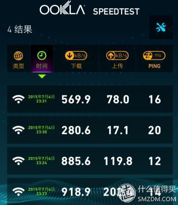

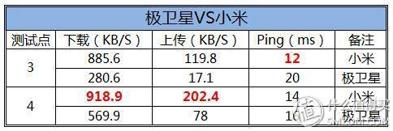

为什么只有3,4连个测试点呢？就像我上面说的，我没有从实际出发（再怎么说它们也只是小型中继器，不是神
），1,2测试点完全连信号都搜不到
，5号点就是同处一室，能有多大差别呢？所以后面的比较也均只保留了3，4号点的测试结果。
从上表很容易看出，所有优值均在小米，小米完胜。但是极卫星的下载速度也基本能满足日常上网需求。
### 测试2：

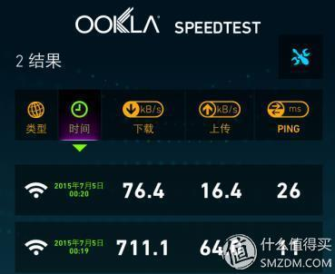

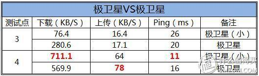

从结果可以看出，以小米作为路由器去带动极卫星，得到的数值明显比FAST带动的要强的多。某些地方已经赶上了之前小米作为中继器的数值。
测试3：

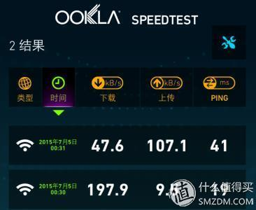

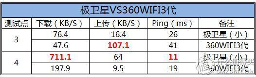

作为跨界产品间的对比，极卫星基本是完胜360WIFI。当然不管从体积，电线等方面本来就是极卫星占着上风。360被灌之为随身，便携与直连才是它的主打优势。
Summary：从三次对比来看，同类产品对比极卫星还存在一定的弱势（当然也因为雷军太强大？
）
## 4.使用心得总结
在写总结之前我想先提醒大家几件事：
> 1.房屋结构其实对WIFI信号的强弱、速率的快慢起了很大的因素。可能有人会问：你不是电信百兆光纤，正面上传下载才那点鸟速度？其实后来有使用电脑连接Download，速度是有达到应有的速度的（不然我就要投诉去了）。这个可能和测试软件、iPhone的性能、以及我觉得房屋结构（我家的承重墙太多？
）
> 2.中继器的速率确实和主路由器有很大的关系，就像车子跑的快慢不是和引擎马力有直接联系一个到里。所有值友们千万不要因为一个中继器的速度慢了就觉得是它本身不好，也许是你的主路由器本来就不给你啊。
> 3.这次的测试结果和我预期相差很多，我也在反思问题出在哪里？如果来得及我很再update这个报告，设置其他条件进行测试

最后的总结： 依据我的期望值和最后的测试结果，如果满分10分，我给出7分的评测分数。假设上面所有测试都是符合规范的，那极卫星的优缺点其实非常明显：

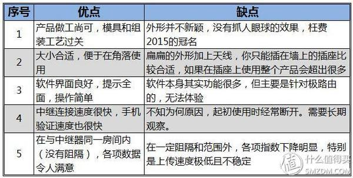

写在最后：
虽然定义为中继器，但是没有任何其他外设接口，实在是太单薄了，99元的价格应该有更多的诚意才对。
颜值在这个社会很重要，努力提升吧
其实中继器的域名可以和主路由器设置同一个，这样方便使用。
我只是个普通用户，也不是处女座，所有评论内容均来则自测的结果的分析，没有黑极卫星的意思。
也许极卫星与极路由的原配格局才能体现出它的优势。
两颗提示灯其实最好在外壳上注明表示内容，这样会更清晰直观。
宣传的适当夸大其实是广告效应，就和汽车工况油耗能和实际油耗比么？大家也不要太较真，不然在中国你要较真的东西太多，太累了。
为国护盘

