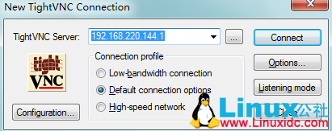
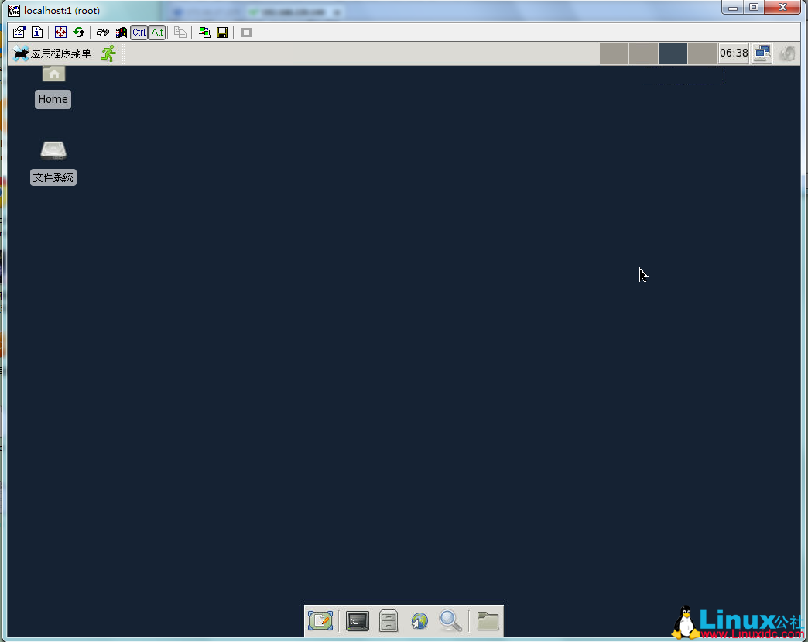

# 注意这里用的是最小化安装纯净系统212个包

### 1、CentOS-6.3-x86_64-minimal.iso
```
#wget http://mirrors.sohu.com/Fedora-epel//6/x86_64/epel-release-6-7.noarch.rpm
#rpm -ivh epel-release-6-7.noarch.rpm
```
其目的是生产epel的yum源文件
```
# ls
CentOS-Base.repo  
CentOS-Base.repo.bak  
CentOS-Debuginfo.repo  
CentOS-Media.repo  
CentOS-Vault.repo  
epel.repo  
epel-testing.repo
```
### 2、安装xfce
```
# yum groupinfo xfce
Loaded plugins: fastestmirror, presto
Setting up Group Process
Loading mirror speeds from cached hostfile
 * epel: kartolo.sby.datautama.net.id
epel/group_gz                                                                                                                         | 229 kB     00:05    
Group: Xfce
 Description: 一个能在低端机器上良好运行的轻便桌面环境。
 Mandatory Packages:
   Thunar
   xfce-utils
   xfce4-panel
   xfce4-session
   xfce4-settings
   xfconf
   xfdesktop
   xfwm4
 Default Packages:
   NetworkManager-gnome
   Terminal
   gdm
   leafpad
   openssh-askpass
   orage
   polkit-gnome
   thunar-archive-plugin
   thunar-volman
   tumbler
   xfce4-appfinder
   xfce4-icon-theme
   xfce4-mixer
   xfce4-power-manager
   xfce4-session-engines
   xfwm4-theme-nodoka
 Optional Packages:
   xfwm4-themes
 Conditional Packages:
   pinentry-gtk
# yum -y groupinstall xfce
```
### 3、又安装了226个包，比系统212个还多
```
Installed:
  NetworkManager-gnome.x86_64 1:0.8.1-33.el6          
  Terminal.x86_64 0:0.4.7-1.el6                       
  Thunar.x86_64 0:1.3.0-4.el6                       
  gdm.x86_64 1:2.30.4-33.el6_2                        
  leafpad.x86_64 0:0.8.18.1-1.el6                     
  openssh-askpass.x86_64 0:5.3p1-81.el6             
  orage.x86_64 0:4.8.1-3.el6                          
  pinentry-gtk.x86_64 0:0.7.6-6.el6                   
  polkit-gnome.x86_64 0:0.96-3.el6                  
  thunar-archive-plugin.x86_64 0:0.3.0-2.el6          
  thunar-volman.x86_64 0:0.6.0-2.el6                  
  tumbler.x86_64 0:0.1.21-1.el6                     
  xfce-utils.x86_64 0:4.8.3-1.el6                     
  xfce4-appfinder.x86_64 0:4.8.0-2.el6                
  xfce4-icon-theme.noarch 0:4.4.3-5.el6             
  xfce4-mixer.x86_64 0:4.8.0-1.el6                    
  xfce4-panel.x86_64 0:4.8.3-2.el6                    
  xfce4-power-manager.x86_64 0:1.0.10-1.el6         
  xfce4-session.x86_64 0:4.8.1-4.el6                  
  xfce4-session-engines.x86_64 0:4.8.1-4.el6          
  xfce4-settings.x86_64 0:4.8.3-1.el6               
  xfconf.x86_64 0:4.8.0-2.el6                         
  xfdesktop.x86_64 0:4.8.2-2.el6                      
  xfwm4.x86_64 0:4.8.3-1.el6                       
Dependency Installed:
  ConsoleKit.x86_64 0:0.4.1-3.el6                                            ConsoleKit-libs.x86_64 0:0.4.1-3.el6                                           
  ConsoleKit-x11.x86_64 0:0.4.1-3.el6                                        DeviceKit-power.x86_64 0:014-3.el6                                             
  GConf2.x86_64 0:2.28.0-6.el6                                               GConf2-gtk.x86_64 0:2.28.0-6.el6                                               
  ModemManager.x86_64 0:0.4.0-3.git20100628.el6                              NetworkManager.x86_64 1:0.8.1-33.el6                                           
  NetworkManager-glib.x86_64 1:0.8.1-33.el6                                  ORBit2.x86_64 0:2.14.17-3.1.el6                                                
  alsa-lib.x86_64 0:1.0.22-3.el6                                             at-spi.x86_64 0:1.28.1-2.el6.centos                                            
  atk.x86_64 0:1.28.0-2.el6                                                  avahi.x86_64 0:0.6.25-11.el6                                                   
  avahi-autoipd.x86_64 0:0.6.25-11.el6                                       avahi-glib.x86_64 0:0.6.25-11.el6                                              
  avahi-libs.x86_64 0:0.6.25-11.el6                                          cairo.x86_64 0:1.8.8-3.1.el6                                                   
  cdparanoia-libs.x86_64 0:10.2-5.1.el6                                      control-center.x86_64 1:2.28.1-37.el6                                          
  control-center-filesystem.x86_64 1:2.28.1-37.el6                           cups-libs.x86_64 1:1.4.2-48.el6                                                
  dbus.x86_64 1:1.2.24-5.el6_1                                               dbus-x11.x86_64 1:1.2.24-5.el6_1                                               
  desktop-file-utils.x86_64 0:0.15-9.el6                                     dmidecode.x86_64 1:2.11-2.el6                                                  
  dmz-cursor-themes.noarch 0:0.4-4.el6                                       dnsmasq.x86_64 0:2.48-6.el6                                                    
  eggdbus.x86_64 0:0.6-3.el6                                                 evolution-data-server.x86_64 0:2.28.3-15.el6                                   
  exo.x86_64 0:0.6.2-2.el6                                                   flac.x86_64 0:1.2.1-6.1.el6                                                    
  fontconfig.x86_64 0:2.8.0-3.el6                                            fortune-mod.x86_64 0:1.99.1-13.el6                                             
  freetype.x86_64 0:2.3.11-6.el6_2.9                                         garcon.x86_64 0:0.1.7-1.el6                                                    
  gdm-libs.x86_64 1:2.30.4-33.el6_2                                          gnome-bluetooth-libs.x86_64 0:2.28.6-8.el6                                     
  gnome-desktop.x86_64 0:2.28.2-9.el6.centos                                 gnome-icon-theme.noarch 0:2.28.0-2.el6                                         
  gnome-keyring.x86_64 0:2.28.2-7.el6                                        gnome-keyring-pam.x86_64 0:2.28.2-7.el6                                        
  gnome-menus.x86_64 0:2.28.0-4.el6                                          gnome-panel-libs.x86_64 0:2.30.2-14.el6                                        
  gnome-python2.x86_64 0:2.28.0-3.el6                                        gnome-python2-gnome.x86_64 0:2.28.0-3.el6                                      
  gnome-python2-gnomevfs.x86_64 0:2.28.0-3.el6                               gnome-session.x86_64 0:2.28.0-18.el6                                           
  gnome-settings-daemon.x86_64 0:2.28.2-20.el6                               gnome-themes.noarch 0:2.28.1-6.el6                                             
  gnome-vfs2.x86_64 0:2.24.2-6.el6                                           gnutls.x86_64 0:2.8.5-4.el6_2.2                                                
  gstreamer.x86_64 0:0.10.29-1.el6                                           gstreamer-plugins-base.x86_64 0:0.10.29-1.el6                                  
  gstreamer-tools.x86_64 0:0.10.29-1.el6                                     gtk2.x86_64 0:2.18.9-10.el6                                                    
  gtk2-engines.x86_64 0:2.18.4-5.el6.centos                                  hal.x86_64 0:0.5.14-11.el6                                                     
  hal-info.noarch 0:20090716-3.1.el6                                         hal-libs.x86_64 0:0.5.14-11.el6                                                
  hdparm.x86_64 0:9.16-3.4.el6                                               hicolor-icon-theme.noarch 0:0.11-1.1.el6                                       
  iso-codes.noarch 0:3.16-2.el6                                              jasper-libs.x86_64 0:1.900.1-15.el6_1.1                                        
  lcms-libs.x86_64 0:1.19-1.el6                                              libICE.x86_64 0:1.0.6-1.el6                                                    
  libIDL.x86_64 0:0.8.13-2.1.el6                                             libSM.x86_64 0:1.1.0-7.1.el6                                                   
  libX11.x86_64 0:1.3-2.el6                                                  libX11-common.noarch 0:1.3-2.el6                                               
  libXScrnSaver.x86_64 0:1.2.0-1.el6                                         libXau.x86_64 0:1.0.5-1.el6                                                    
  libXcomposite.x86_64 0:0.4.1-2.el6                                         libXcursor.x86_64 0:1.1.10-2.el6                                               
  libXdamage.x86_64 0:1.1.2-1.el6                                            libXdmcp.x86_64 0:1.0.3-1.el6                                                  
  libXext.x86_64 0:1.1-3.el6                                                 libXfixes.x86_64 0:4.0.4-1.el6                                                 
  libXfont.x86_64 0:1.4.1-2.el6_1                                            libXft.x86_64 0:2.1.13-4.1.el6                                                 
  libXi.x86_64 0:1.3-3.el6                                                   libXinerama.x86_64 0:1.1-1.el6                                                 
  libXmu.x86_64 0:1.0.5-1.el6                                                libXrandr.x86_64 0:1.3.0-4.el6                                                 
  libXrender.x86_64 0:0.9.5-1.el6                                            libXres.x86_64 0:1.0.4-1.el6                                                   
  libXt.x86_64 0:1.0.7-1.el6                                                 libXtst.x86_64 0:1.0.99.2-3.el6                                                
  libXv.x86_64 0:1.0.5-1.el6                                                 libXxf86misc.x86_64 0:1.0.2-1.el6                                              
  libXxf86vm.x86_64 0:1.1.0-1.el6                                            libart_lgpl.x86_64 0:2.3.20-5.1.el6                                            
  libasyncns.x86_64 0:0.8-1.1.el6                                            libbonobo.x86_64 0:2.24.2-5.el6                                                
  libbonoboui.x86_64 0:2.24.2-3.el6                                          libcanberra.x86_64 0:0.22-1.el6.centos                                         
  libcanberra-gtk2.x86_64 0:0.22-1.el6.centos                                libdaemon.x86_64 0:0.14-1.el6                                                  
  libexif.x86_64 0:0.6.16-4.1.el6                                            libfontenc.x86_64 0:1.0.5-2.el6                                                
  libgail-gnome.x86_64 0:1.20.1-4.1.el6.centos                               libglade2.x86_64 0:2.6.4-3.1.el6                                               
  libgnome.x86_64 0:2.28.0-11.el6                                            libgnomecanvas.x86_64 0:2.26.0-4.el6                                           
  libgnomekbd.x86_64 0:2.28.2-2.el6                                          libgnomeui.x86_64 0:2.24.1-4.el6                                               
  libgudev1.x86_64 0:147-2.42.el6                                            libgweather.x86_64 0:2.28.0-5.el6                                              
  libical.x86_64 0:0.43-5.1.el6                                              libjpeg.x86_64 0:6b-46.el6                                                     
  libmcpp.x86_64 0:2.7.2-4.1.el6                                             libnotify.x86_64 0:0.5.0-1.el6                                                 
  libogg.x86_64 2:1.1.4-2.1.el6                                              liboil.x86_64 0:0.3.16-4.1.el6                                                 
  libpcap.x86_64 14:1.0.0-6.20091201git117cb5.el6                            libpng.x86_64 2:1.2.49-1.el6_2                                                 
  libproxy.x86_64 0:0.3.0-2.el6                                              libproxy-bin.x86_64 0:0.3.0-2.el6                                              
  libproxy-python.x86_64 0:0.3.0-2.el6                                       libsndfile.x86_64 0:1.0.20-5.el6                                               
  libsoup.x86_64 0:2.28.2-1.el6_1.1                                          libtasn1.x86_64 0:2.3-3.el6_2.1                                                
  libtdb.x86_64 0:1.2.1-3.el6                                                libthai.x86_64 0:0.1.12-3.el6                                                  
  libtheora.x86_64 1:1.1.0-2.el6                                             libtiff.x86_64 0:3.9.4-6.el6_3                                                 
  libtool-ltdl.x86_64 0:2.2.6-15.5.el6                                       libvisual.x86_64 0:0.4.0-9.1.el6                                               
  libvorbis.x86_64 1:1.2.3-4.el6_2.1                                         libwacom.x86_64 0:0.5-3.el6                                                    
  libwacom-data.noarch 0:0.5-3.el6                                           libwnck.x86_64 0:2.28.0-3.el6                                                  
  libxcb.x86_64 0:1.5-1.el6                                                  libxfce4ui.x86_64 0:4.8.0-4.el6                                                
  libxfce4util.x86_64 0:4.8.1-2.el6                                          libxkbfile.x86_64 0:1.0.6-1.1.el6                                              
  libxklavier.x86_64 0:4.0-9.el6                                             libxslt.x86_64 0:1.1.26-2.el6                                                  
  mailcap.noarch 0:2.1.31-2.el6                                              mcpp.x86_64 0:2.7.2-4.1.el6                                                    
  metacity.x86_64 0:2.28.0-23.el6                                            mobile-broadband-provider-info.noarch 0:1.20100122-1.el6                       
  notification-daemon.x86_64 0:0.5.0-1.el6                                   openjpeg-libs.x86_64 0:1.3-8.el6_3                                             
  pango.x86_64 0:1.28.1-3.el6_0.5.1.centos                                   perl-Compress-Raw-Zlib.x86_64 1:2.020-127.el6                                  
  perl-Compress-Zlib.x86_64 0:2.020-127.el6                                  perl-HTML-Parser.x86_64 0:3.64-2.el6                                           
  perl-HTML-Tagset.noarch 0:3.20-4.el6                                       perl-IO-Compress-Base.x86_64 0:2.020-127.el6                                   
  perl-IO-Compress-Zlib.x86_64 0:2.020-127.el6                               perl-URI.noarch 0:1.40-2.el6                                                   
  perl-XML-Parser.x86_64 0:2.36-7.el6                                        perl-libwww-perl.noarch 0:5.833-2.el6                                          
  pixman.x86_64 0:0.18.4-1.el6_0.1                                           pkgconfig.x86_64 1:0.23-9.1.el6                                                
  plymouth-gdm-hooks.x86_64 0:0.8.3-24.el6.centos                            plymouth-utils.x86_64 0:0.8.3-24.el6.centos                                    
  pm-utils.x86_64 0:1.2.5-9.el6                                              polkit.x86_64 0:0.96-2.el6_0.1                                                 
  polkit-desktop-policy.noarch 0:0.96-2.el6_0.1                              poppler.x86_64 0:0.12.4-3.el6_0.1                                              
  poppler-data.noarch 0:0.4.0-1.el6                                          poppler-glib.x86_64 0:0.12.4-3.el6_0.1                                         
  ppp.x86_64 0:2.4.5-5.el6                                                   pulseaudio-gdm-hooks.x86_64 0:0.9.21-14.el6_3                                  
  pulseaudio-libs.x86_64 0:0.9.21-14.el6_3                                   pulseaudio-libs-glib2.x86_64 0:0.9.21-14.el6_3                                 
  pycairo.x86_64 0:1.8.6-2.1.el6                                             pygobject2.x86_64 0:2.20.0-5.el6                                               
  pygtk2.x86_64 0:2.16.0-3.el6                                               rarian.x86_64 0:0.8.1-5.1.el6                                                  
  rarian-compat.x86_64 0:0.8.1-5.1.el6                                       recode.x86_64 0:3.6-28.1.el6                                                   
  RedHat-menus.noarch 0:14.0.0-3.el6                                         sgml-common.noarch 0:0.6.3-32.el6                                              
  shared-mime-info.x86_64 0:0.70-4.el6                                       sound-theme-freedesktop.noarch 0:0.7-3.el6                                     
  startup-notification.x86_64 0:0.10-2.1.el6                                 system-gnome-theme.noarch 0:60.0.2-1.el6                                       
  system-icon-theme.noarch 0:6.0.0-2.el6                                     system-setup-keyboard.x86_64 0:0.7-4.el6                                       
  usermode.x86_64 0:1.102-3.el6                                              vte.x86_64 0:0.25.1-7.el6                                                      
  wpa_supplicant.x86_64 1:0.7.3-3.el6                                        xcb-util.x86_64 0:0.3.6-1.el6                                                  
  xfce4-doc.noarch 0:4.8.3-1.el6                                             xkeyboard-config.noarch 0:2.3-1.el6                                            
  xml-common.noarch 0:0.6.3-32.el6                                           xorg-x11-drv-evdev.x86_64 0:2.6.0-2.el6                                        
  xorg-x11-drv-vesa.x86_64 0:2.3.0-2.el6                                     xorg-x11-drv-void.x86_64 0:1.4.0-1.el6                                         
  xorg-x11-drv-wacom.x86_64 0:0.13.0-6.el6                                   xorg-x11-server-Xorg.x86_64 0:1.10.6-1.el6.centos                              
  xorg-x11-server-common.x86_64 0:1.10.6-1.el6.centos                        xorg-x11-server-utils.x86_64 0:7.5-5.2.el6                                     
  xorg-x11-xauth.x86_64 1:1.0.2-7.1.el6                                      xorg-x11-xinit.x86_64 0:1.0.9-13.el6                                           
  xorg-x11-xkb-utils.x86_64 0:7.4-6.el6                                      zenity.x86_64 0:2.28.0-1.el6                                                  
Dependency Updated:
  libudev.x86_64 0:147-2.42.el6                                                                                                                             
Complete!
```
### 4， 安装 vncserver
```
# yum -y install tigervnc-server
Loaded plugins: fastestmirror, presto
Loading mirror speeds from cached hostfile
Setting up Install Process
Resolving Dependencies
--> Running transaction check
---> Package tigervnc-server.x86_64 0:1.0.90-0.17.20110314svn4359.el6 will be installed
--> Processing Dependency: xorg-x11-fonts-misc for package: tigervnc-server-1.0.90-0.17.20110314svn4359.el6.x86_64
--> Processing Dependency: mesa-dri-drivers for package: tigervnc-server-1.0.90-0.17.20110314svn4359.el6.x86_64
--> Running transaction check
---> Package mesa-dri-drivers.x86_64 0:7.11-5.el6 will be installed
---> Package xorg-x11-fonts-misc.noarch 0:7.2-9.1.el6 will be installed
--> Processing Dependency: mkfontdir for package: xorg-x11-fonts-misc-7.2-9.1.el6.noarch
--> Processing Dependency: mkfontdir for package: xorg-x11-fonts-misc-7.2-9.1.el6.noarch
--> Running transaction check
---> Package xorg-x11-font-utils.x86_64 1:7.2-11.el6 will be installed
--> Finished Dependency Resolution
Dependencies Resolved
***

 Package                                  Arch                        Version                                                Repository                 Size
***

Installing:
 tigervnc-server                          x86_64                      1.0.90-0.17.20110314svn4359.el6                        base                      1.1 M
Installing for dependencies:
 mesa-dri-drivers                         x86_64                      7.11-5.el6                                             base                       11 M
 xorg-x11-font-utils                      x86_64                      1:7.2-11.el6                                           base                       75 k
 xorg-x11-fonts-misc                      noarch                      7.2-9.1.el6                                            base                      5.8 M
Transaction Summary
***
Install       4 Package(s)
Total download size: 18 M
Installed size: 48 M
Downloading Packages:
Setting up and reading Presto delta metadata
Processing delta metadata
Package(s) data still to download: 18 M
(1/4): mesa-dri-drivers-7.11-5.el6.x86_64.rpm                                                                                         |  11 MB     00:40     
(2/4): tigervnc-server-1.0.90-0.17.20110314svn4359.el6.x86_64.rpm                                                                     | 1.1 MB     00:02     
(3/4): xorg-x11-font-utils-7.2-11.el6.x86_64.rpm                                                                                      |  75 kB     00:00     
(4/4): xorg-x11-fonts-misc-7.2-9.1.el6.noarch.rpm                                                                                     | 5.8 MB     00:18     
***
Total                                                                                                                        259 kB/s |  18 MB     01:10     
Running rpm_check_debug
Running Transaction Test
Transaction Test Succeeded
Running Transaction
  Installing : 1:xorg-x11-font-utils-7.2-11.el6.x86_64                                                                                                   1/4 
  Installing : xorg-x11-fonts-misc-7.2-9.1.el6.noarch                                                                                                    2/4 
  Installing : mesa-dri-drivers-7.11-5.el6.x86_64                                                                                                        3/4 
  Installing : tigervnc-server-1.0.90-0.17.20110314svn4359.el6.x86_64                                                                                    4/4 
  Verifying  : mesa-dri-drivers-7.11-5.el6.x86_64                                                                                                        1/4 
  Verifying  : tigervnc-server-1.0.90-0.17.20110314svn4359.el6.x86_64                                                                                    2/4 
  Verifying  : xorg-x11-fonts-misc-7.2-9.1.el6.noarch                                                                                                    3/4 
  Verifying  : 1:xorg-x11-font-utils-7.2-11.el6.x86_64                                                                                                   4/4
Installed:
  tigervnc-server.x86_64 0:1.0.90-0.17.20110314svn4359.el6                                                                                                  
Dependency Installed:
  mesa-dri-drivers.x86_64 0:7.11-5.el6             xorg-x11-font-utils.x86_64 1:7.2-11.el6             xorg-x11-fonts-misc.noarch 0:7.2-9.1.el6           
Complete!
```
### 5，生成帐号配置文件
```
# vncserver
You will require a password to access your desktops.
Password:
Verify:
xauth: (stdin):1:  bad display name "bogon:1" in "add" command
New 'bogon:1 (root)' desktop is bogon:1
Creating default startup script /root/.vnc/xstartup
Starting applications specified in /root/.vnc/xstartup
Log file is /root/.vnc/bogon:1.log
# su - tao
$ vncserver
You will require a password to access your desktops.
Password:
Verify:
xauth: (stdin):1:  bad display name "bogon:2" in "add" command
New 'bogon:2 (tao)' desktop is bogon:2
Creating default startup script /home/tao/.vnc/xstartup
Starting applications specified in /home/tao/.vnc/xstartup
Log file is /home/tao/.vnc/bogon:2.log
$ ls .vnc/
bogon:2.log  bogon:2.pid  passwd  xstartup
```
### 6，修改xstartup用xfce4桌面
```
[root@localhost ~]# cat ~/.vnc/xstartup
#!/bin/sh
/usr/bin/startxfce4 &
```
### 7，修改vncservers配置文件该文件可以设置客户端帐号连接信息
```
# tail -n 3 /etc/sysconfig/vncservers 
VNCSERVERS="1:root 2:tao "
VNCSERVERARGS[1]="-geometry 1024x768"
VNCSERVERARGS[2]="-geometry 1024x768"
```
### 8，开启vncserver服务 
```
# /etc/init.d/vncserver restart
关闭 VNC 服务器：[确定]
正在启动 VNC 服务器：1:root 
New 'localhost:1 (root)' desktop is localhost:1
Starting applications specified in /root/.vnc/xstartup
Log file is /root/.vnc/localhost:1.log
2:tao 
New 'localhost:2 (tao)' desktop is localhost:2
Starting applications specified in /home/tao/.vnc/xstartup
Log file is /home/tao/.vnc/localhost:2.log
[确定]
# chkconfig vncserver on
```
### 9，关闭selinux，设置防火墙
```
# grep SELINUX /etc/sysconfig/selinux 
# SELINUX= can take one of these three values:
SELINUX=disabled
# SELINUXTYPE= can take one of these two values:
SELINUXTYPE=targeted 
# getenforce 
Disabled
# iptables -L
Chain INPUT (policy ACCEPT)
target     prot opt source               destination         
ACCEPT     all  --  anywhere             anywhere            state RELATED,ESTABLISHED 
ACCEPT     icmp --  anywhere             anywhere            
ACCEPT     all  --  anywhere             anywhere            
ACCEPT     tcp  --  anywhere             anywhere            state NEW tcp dpt:ssh 
ACCEPT     tcp  --  anywhere             anywhere            state NEW tcp dpts:5901:5902 
REJECT     all  --  anywhere             anywhere            reject-with icmp-host-prohibited
Chain FORWARD (policy ACCEPT)
target     prot opt source               destination         
REJECT     all  --  anywhere             anywhere            reject-with icmp-host-prohibited
Chain OUTPUT (policy ACCEPT)
target     prot opt source               destination      
```
### 10，客户端连接




