# 第一章：配置远程桌面
本文由秀依林枫提供友情赞助，首发于烂泥行天下
公司服务器目前安装的都是ubuntu 14.04系统，而且由于业务需要，需要使用到ubuntu的远程桌面功能。所以本篇文章都是围绕ubuntu的远程桌面来介绍。

##一、远程桌面连接方式

ubuntu的远程桌面连接要说简单也很简单，要说复杂也很复杂。ubuntu远程桌面连接的方式，目前主要有两种方式：基于VNC方式的和基于XRDP方式的。
基于VNC方式的远程桌面连接，不在本篇文章中进行介绍。本文主要介绍基于XRDP方式的远程桌面连接。
注意：基于XRDP方式的远程桌面连接还需要vncserver的支持，所以在进行软件安装时，还要安装vncserver软件包。
我们本次试验基于ubuntu14.04 64bit桌面版。因为现在公司使用的OS既有ubuntu desktop桌面版，又有ubuntu server服务器版，所以如果ubuntu desktop 桌面版与ubuntu server服务器版不同的地方，我会在文章中提出来。

## 二、ubuntu远程桌面配置

无论是在ubuntu desktop桌面版还是ubuntu server服务器版上配置远程桌面，都需要我们安装x windows桌面环境软件包、vncserver软件包以及xrdp软件包。
### 2.1 安装相关软件
x windows桌面环境软件比较多，在此我们选择的是轻量级的xfce4。
注意：建议在ubuntu desktop桌面版上不要使用lxde，这个x windows桌面环境软件。因为本人经过测试，lxde在桌面版上显示不正常。但是如果是在ubuntu server服务器版的话，可以安装xfce4或者lxde这两种x windows桌面环境软件的一个。
软件安装如下：
```
$sudo apt-get -y install xfce4 xrdp vnc4server
```

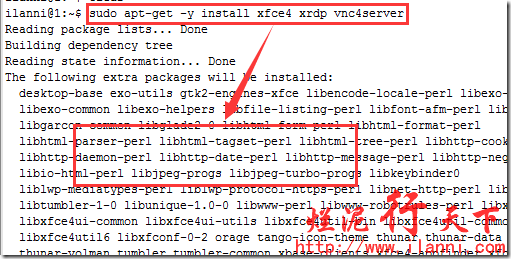


软件安装完毕后，我们来查看下相关软件包。如下：
```
$dpkg -L xrdp
```

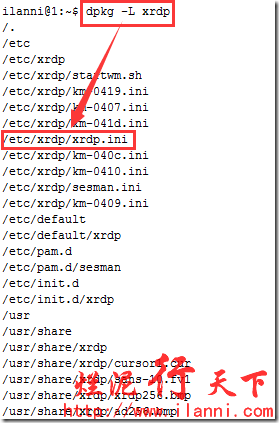


在上图的xrdp安装文件中，我们需要注意xrdp.ini这个文件，有关这个文件的使用，我会在下一篇文章ubuntu远程桌面会话管理中进行讲解。
```
$dpkg -L vnc4server
```
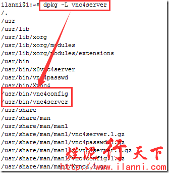


### 2.2 配置xfce4桌面会话文件
软件安装完毕后，我们还需要为每一个需要使用远程桌面登陆到系统的用户配置一个xfce4桌面会话文件。如果不配置该文件的话，用户登陆后只有黑白点为背景，无图标也无法操作。如下：


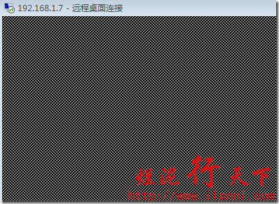


注意：是为每一个需要使用远程桌面的用户。
为什么会出现上述情况？这是因为xrdp、gnome和unity之间的兼容性问题导致的。
配置xfce4桌面会话文件，我们只需要把xfce4-session这行命令保存到该用户的家目录下。如下：
```
$echo xfce4-session>.xsession
$cat .xsession
```


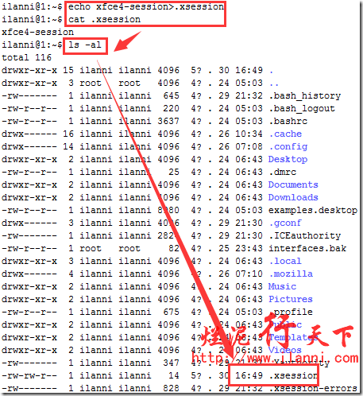


注意：在此我们是以ilanni这个用户进行测试的。如果使用其他用户进行测试的话，一定要在该用户的家目录下，把上述xfce4桌面会话文件保存一份。
同时，还需要注意ubuntu server服务器版是不需要配置xfce4桌面会话文件的。因为ubuntu server服务器版不存在xrdp、gnome和unity之间的兼容性问题。

### 2.3 远程桌面连接
相关软件安装完毕并配置完毕后，我们就可以通过远程桌面软件来连接这台主机。
在此我们使用的是windows自带的远程桌面来连接，如下：


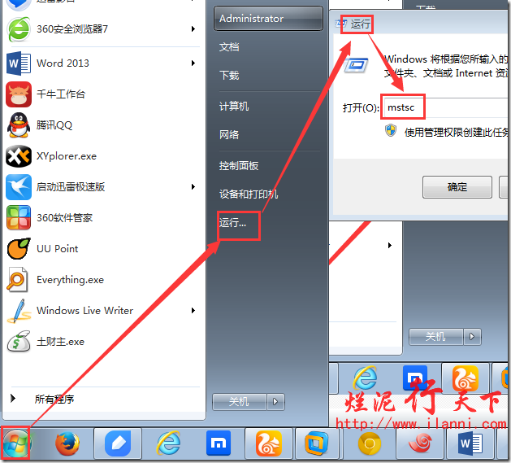


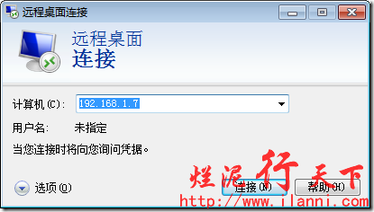


在下图中，输入登陆到系统的用户名和密码。


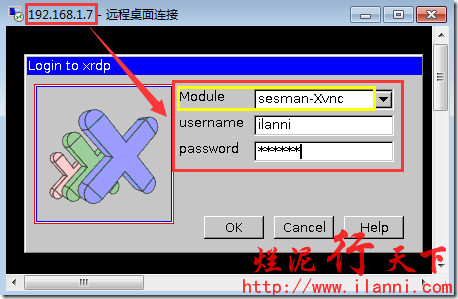


注意：上图中“Module”中选择sesman-Xvnc，username和password中填入相应的用户和密码即可。


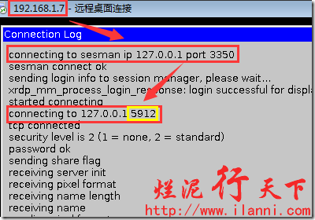


注意：上图中connecting to 127.0.0.1 5912这行。这行的作用，我会在下一篇文章中进行讲解。


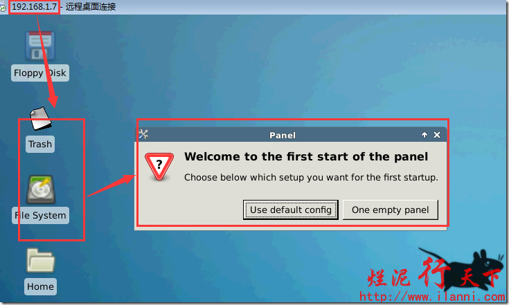


以上就是远程成功登陆到ubuntu系统中的界面。

## 三、远程桌面键盘补全

远程登陆进入ubuntu系统后，你会发现在终端中使用tab补全相关命令时，会不起作用。
这是因为xfce4桌面配置文件中有关键盘的操作被占用造成的。
要解决这个这个问题有两种方法，如下：
### 方法一：
编辑.config/xfce4/xfconf/xfce-perchannel-xml目录下的xfce4-keyboard-shortcuts.xml文件，在里面内容里找到
```
<property name="&lt;Super&gt;Tab" type="string" value="switch_window_key"/>，
```
把它用这句替换
```
<property name="&lt;Super&gt;Tab" type="empty"/>。
```
然后重新启动系统后即可解决问题。如下：


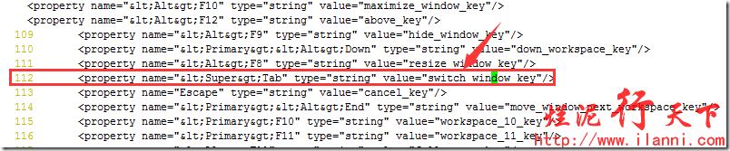


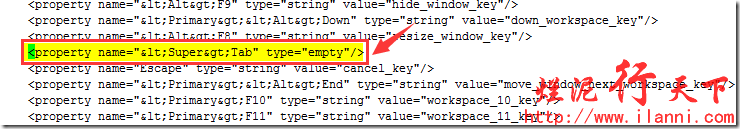


### 方法二：
该方法不需要你去重新启动系统，在远程桌面中进行设置，路径是：打开菜单—设置—窗口管理器，如下：


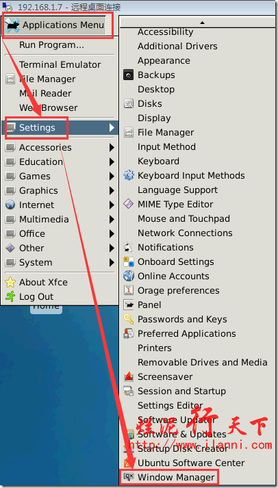


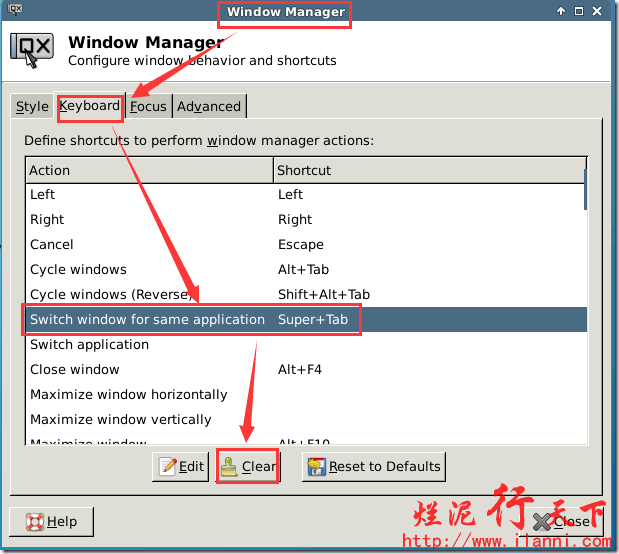


或者在终端中输入xfwm4-settings打开也行（xfwm4就是xfce4 window manger的缩写），选择键盘，可以看到窗口快捷键中动作一列有“切换同一应用程序的窗口”选项，将该选项的快捷键清除后关闭窗口即可解决问题。如下：


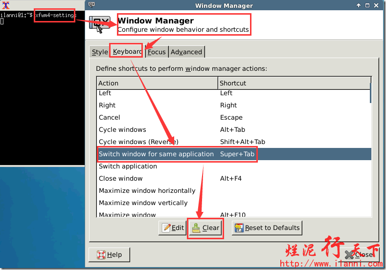


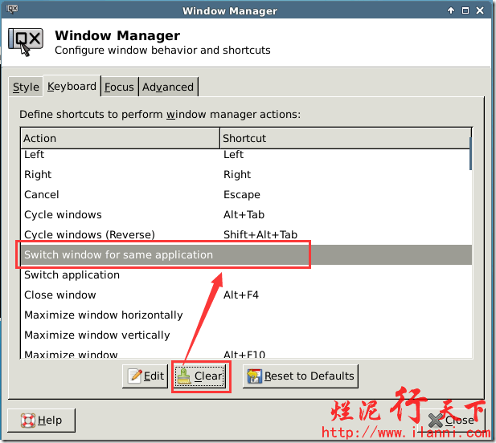


经过以上设置后，我们再在终端中使用Tab键补全就可以使用了。所以以上两种方法，建议采用第二种。
## 第二章：远程桌面会话管理

在上一篇文章中，我们讲解了如何给ubuntu安装远程桌面及其配置，这篇文章我们再来讲解下有关ubuntu远程桌面会话的问题。

### 一、问题描述
在我们使用ubuntu远程桌面时，会经常遇到这样的问题。在连接远程桌面时，我打开的是会话A，我在会话A下处理一些工作的事情。由于自己不小心把这个远程桌面给关闭了，或者今天工作完毕关闭该远程桌面会话。等再进行连接远程桌面时，发现ubuntu会给出一个新的远程桌面会话B，而不是我们刚刚连接过的那个会话A，或者是昨天连接的那个会话A。
以上这个问题，我们在实际的工作中是经常遇到的。
那么我们该如何解决这个问题呢？或者换一种说法，我们该如何再次连接到上一次的远程桌面会话A呢？
注意：本篇文章中的ubuntu远程桌面全部是基于XRDP协议。

### 二、ubuntu远程桌面的原理

要解决以上的问题，我们就要了解基于xrdp协议的ubuntu远程桌面与vncserver之间的关系。
其实有关ubuntu远程桌面的原理，我们在上一篇文章《烂泥：学习ubuntu远程桌面（一）：配置远程桌面》中已经提到过一些，基于XRDP方式的远程桌面连接是需要vncserver的支持。
为什么需要vncserver的支持呢？是因为我们在通过3389端口连接ubuntu远程桌面时，xrdp会把所有通过3389端口数据都转发到vncserver的端口上，同时vncserver只监听127.0.0.1这个地址，所以vncserver的端口是不对外开放的。
除此之外，vncserver还为每一次远程桌面会话分配一个系统端口，注意这个端口很重要。
如果我们要连接上一次的远程桌面会话A的，我们只需要连接会话A所在vncserver端口即可。
那么我们如何才能连接和查看这个vncserver端口呢？这就需要我们修改xrdp的相关配置。
为什么要讲解这个原理？是因为只有我们理解了这个原理，那么我们才能很容易的解决ubuntu远程桌面会话的问题，而且也能很容易的理解，我们对xrdp配置文件的相关修改。

### 三、XRDP配置文件详解
XRDP配置文件有两个，分别是/etc/xrdp目录下的xrdp.ini和sesman.ini文件。
xrdp.ini配置文件，关键部分在globals，具体内容如下：
```
[globals]
bitmap_cache=yes 位图缓存
bitmap_compression=yes 位图压缩
port=3389 xrdp监听的端口（重要）
crypt_level=low 加密程度（low为40位，high为128位，medium为双40位）
channel_code=1
max_bpp=24 XRDP最大连接数
[xrdp1]
name=sesman-Xvnc XRDP的连接模式
lib=libvnc.so
username=ask
password=ask
ip=127.0.0.1
port=-1
```
注意：在xrdp.ini配置文件中，需要注意max_bpp参数，这参数定义XRDP最大的连接数。
要解决本文所提出的问题，我们只需要修改sesman-Xvnc模式中的port参数。修改后的prot参数，如下：
```
$cat /etc/xrdp/xrdp.ini
```

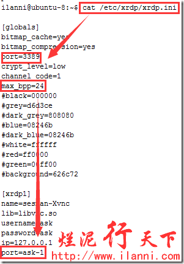


sesman.ini配置文件，内容如下：
```
[Globals]
ListenAddress=127.0.0.1 监听ip地址(默认即可)
ListenPort=3350 监听端口(默认即可)
EnableUserWindowManager=1 1为开启,可让用户自定义自己的启动脚本
UserWindowManager=startwm.sh
DefaultWindowManager=startwm.sh
[Security]
AllowRootLogin=1 允许root登陆
MaxLoginRetry=4 最大重试次数
TerminalServerUsers=tSUSErs 允许连接的用户组(如果不存在则默认全部用户允许连接)
TerminalServerAdmins=tsadmins 允许连接的超级用户(如果不存在则默认全部用户允许连接)
[Sessions]
MaxSessions=10 每个用户最大会话数
KillDisconnected=0 是否立即关闭断开的连接(如果为1,则断开连接后会自动注销)
IdleTimeLimit=0 空闲会话时间限制(0为没有限制)
DisconnectedTimeLimit=0 断开连接的存活时间(0为没有限制)
[Logging]
LogFile=./sesman.log 登陆日志文件
LogLevel=DEBUG 登陆日志记录等级(级别分别为,core,error,warn,info,debug)
EnableSyslog=0 是否开启日志
SyslogLevel=DEBUG 系统日志记录等级
```
### 四、连接远程桌面
现在我们来通过远程桌面来连接ubuntu，如下：


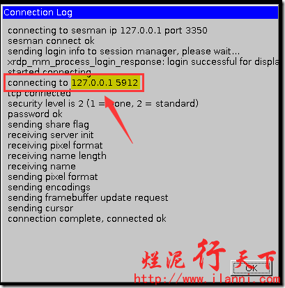


注意：图中标记出来的端口号
远程桌面连接进入后，打开终端创建一个文件test，如下：


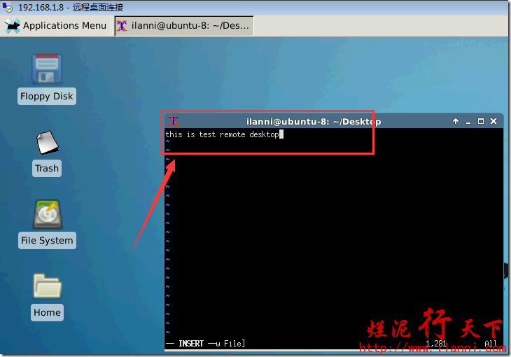


test创建完毕后，然后关闭这个远程桌面连接。
注意：为了下面的演示效果，创建该文件的界面，我没有关闭。
此时我们再通过ssh登录进入ubuntu，查看此时vncserver所使用的端口，如下：
```
netstat –tunlp
ps -ef |grep 1673
```

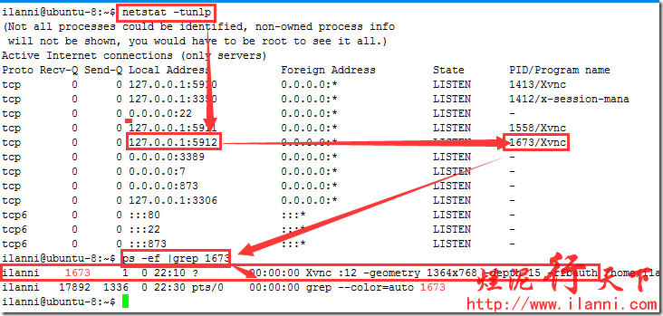


通过上图，我们可以知道目前这个会话，vncserver使用的是5912这个端口。
现在我们修改下xrdp的配置文件xrdp.ini，如下：
```
$sudo vi /etc/xrdp/xrdp.ini
```

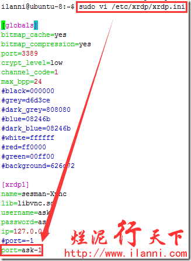


以上修改完毕后，我们要重新启动xrdp，如下：
```
$sudo /etc/init.d/xrdp restart
```

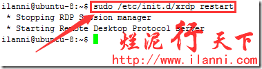


重启完毕后，我们再次连接远程桌面，如下：


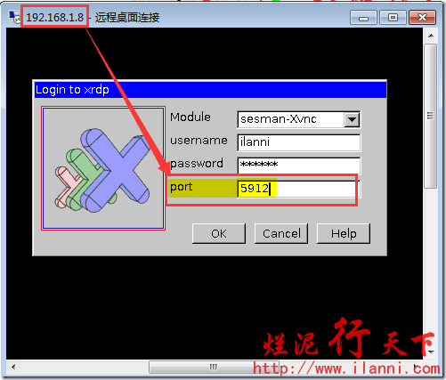


注意：上图中的port端口，我们填写的是5912这个端口，也就是上边那个远程桌面会话vncserver所使用的端口。
远程桌面进去后，如下：


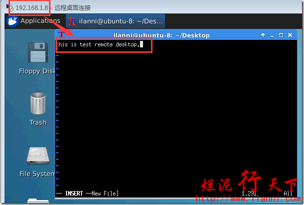


通过上图，我们可以很明显的看出，我们确实连接到了上次本关闭的那个远程桌面界面。
PS：如果不知道每一次的连接的端口的话，我们也可以通过上查看用户的xrdp日志进行查看。具体步骤，如下：
```
$sudo cat /var/log/xrdp-sesman.log
```

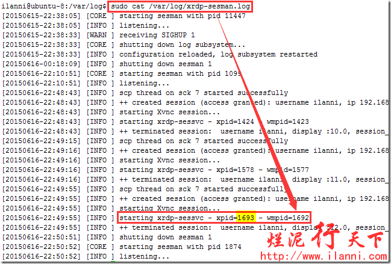


通过xrdp日志查看用户启动xrdp的pid。
然后再根据pid，查看启动的xrdp进程，如下：
```
$ps -ef |grep 1693
```

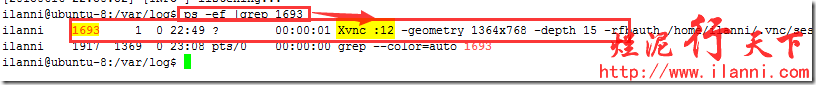


通过上图，基本可以看出此xrdp进程所使用的是5912端口。
为了更清晰的确认端口号，使用netstat命令，如下：
```
$netstat -tunlp
```

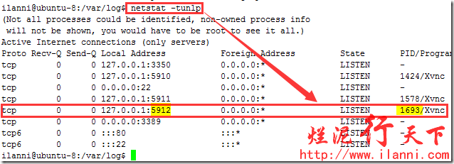


通过上图，可以很明显的看出pid为1693的xrdp，使用的是5912 端口。
到此有关ubuntu远程桌面会话的问题全部结束。

## 第三章：实战不同桌面(ubuntu 14.04)
### 一、ubuntu自带的桌面Unity

无论怎么测试，就是黑屏，在网上查询资料，据说这个是不能实现远程VNCServer，由于XRDP是基于VNCServer。

### 二、gnome 

网上的资料显示，在ubuntu 14.04，也是不能显示的。

### 三、xfce4
成功的显示，根据资料，需要在登陆的用户名/home/username目录下，建立这样的文件
```
$echo "xfce4-session" > .xsession
```
### 四、LXDE
LXDE是一个小型的桌面系统。这样安装
```
$sudo apt-get install lxde-session
```
同样，采用这样的操作
```
$echo "lxsession" > .xsession
```
使用mstsc登陆，可以显示，下面是显示的画面


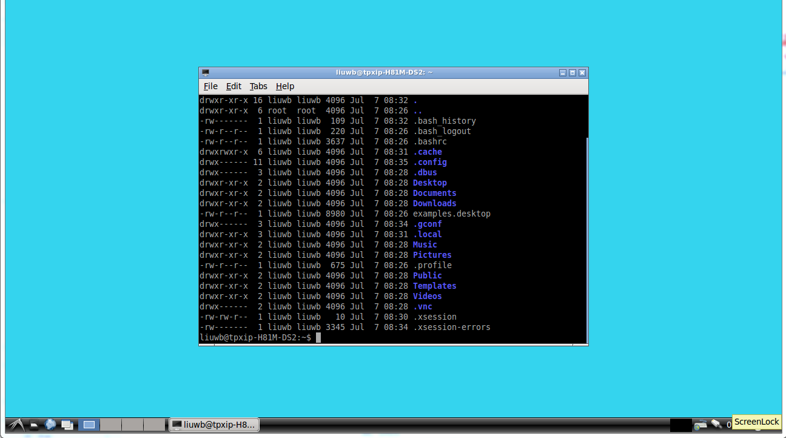


