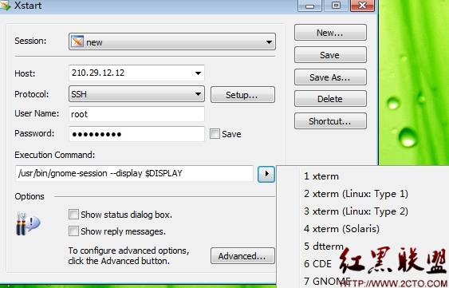
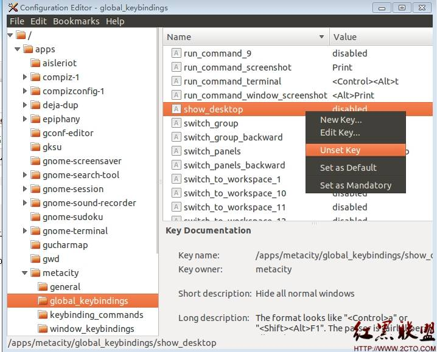

# 访问ubuntu11.04 vnc server时无法敲d键  

当用vnc viewer查看ubuntu启动的vnc server时，没法键入d这个字母。键入d时，会最小化当前的应用程序。
## 解决方法：
点击菜单 “系统--<首选项--<键盘快捷键”
在弹出的窗口中，把对应于“窗口管理--<隐藏所有正常窗口并将桌面设置为焦点"所对应的快捷键禁用或改成别的键。

## ubuntu安装vncserver后终端消失的问题
据说这是一个bug,不过也不算，快捷键冲突常有的事。
安装好vncserver后，从客户端登陆，一按D键就显示桌面
安装gconf-editor，d键都不能用了，这玩意怎么装？
呵呵，一个办法就是到机器前，…
可是我的不在面前啊，这时候可以借助工具了，我用的是xmanager
启动xstart:





我选择的是7GNOME,点击Run
xmanager还是很好用的，它将窗口分成了很多部分，方便使用。如panel,launcher,Desktop,一般你打开什么都可以单独运行，而
不依托于桌面。
现在安装：
```
root@veyun:~#sudo apt-get install  gconf-editor
```
运行：
```
root@veyun:~#gconf-editor
root@veyun:~# gconf-editor
No protocol specified
** （gconf-editor:3309）： CRITICAL **: Failed to parse arguments: Cannot open display:
```
好吧，忘了设置DISPLAY了
```
root@veyun:~# export DISPLAY=210.29.20.38:0.0
210…->你本机IP地址
```
现在再运行，ok
设置：/apps/metacity/global_keybindings/show_desktop为disable





## ubuntu 13.04实际上可以用命令进行设置
```
$gconftool-2 --type=string --set /apps/metacity/global_keybindings/show_desktop 'disabled'
```
