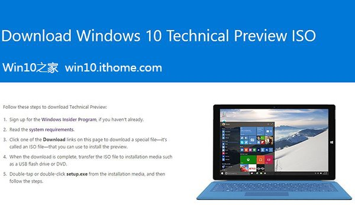
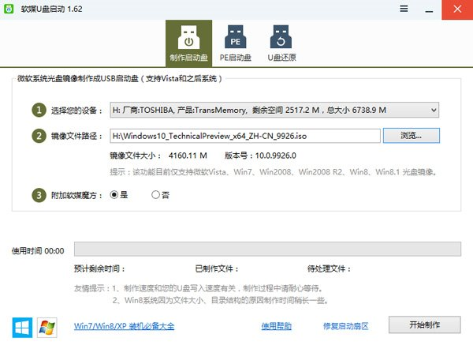
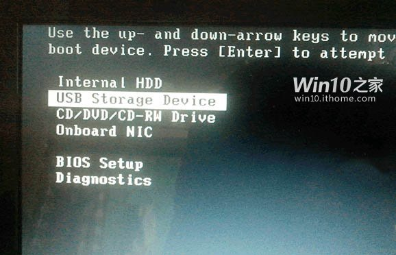
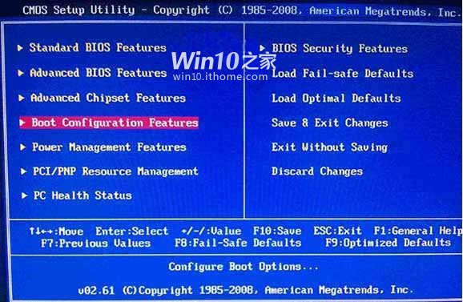
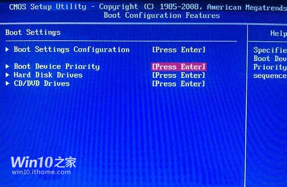

玩转Windows10系统盘镜像四板斧：
下载ISO后，可以用软媒魔方（点击访问官网）中的软媒文件大师（点此下载）来获取SHA1、MD5、CRC等校验值，确保下载的是原版镜像，不给木马病毒留机会；
软媒魔方中的软媒U盘启动（点此下载）可以把ISO制作成启动U盘来进行安装，既省去了刻盘的麻烦，还可以随手分享给小伙伴；
软媒魔方中的软媒虚拟光驱（点此下载），可以把ISO镜像直接虚拟成一个光驱，方便您直接运行安装。
软媒魔方中的软媒硬盘装机（点此下载），可以轻松安装Win7、Win8、Win8.1、Win10等单多系统，一键完成，仅需30秒！

下载地址：
Win10技术预览版：
 - 安装密钥：NKJFK-GPHP7-G8C3J-P6JXR-HQRJR（和之前的不同，此为最新密钥）
 - 语言版本：包含英语、英语（英国）、中文（简体）在内，共计22种语言版本。
 - Windows Insider内测计划会员注册：点击此处
下载地址列表：
中文（简体）64位：下载地址
文件大小：4.06GB
SHA-1 散列值：39F660C94C54B07B416B47F5E8BA2AB9A8CEB593
中文（简体）32位：下载地址
文件大小：3.13GB
SHA-1 散列值：A6691C15D59B3ED3C0ACB642CBDFF9AE4B7FB19E
===========================================
英语（美国） 64位：下载地址
文件大小：3.92GB
SHA-1 散列值：6A95316728299D95249A29FBEB9676DED23B8BEB
英文（美国） 32位：下载地址
文件大小：3.01GB
SHA-1 散列值：1AE10947CC297AE299E1C81F95812EFBB5C84121
===========================================
英语（英国）64位：下载地址
文件大小：3.92GB
SHA-1 散列值：26DC8B6C95E9DDE0F667D6788AB4FBD03DA52F02
英文（英国）32位：下载地址
文件大小：3.01GB
SHA-1 散列值：137196818A33DA6059FB0AC476AB400401A66BD2
===========================================
 Windows 10 Enterprise Technical Preview企业版下载
 - 密钥：PBHCJ-Q2NYD-2PX34-T2TD6-233PK
中文（简体）64位：下载地址
文件大小：3.95GB
中文（简体）32位：下载地址
文件大小：3.03GB
===========================================
注意：Win10预览版9901用户请直接下载ISO镜像，覆盖安装升级！其他版本请在升级至9879，并确认安装KB3025380补丁后，通过预览版更新程序获取推送升级更新，也可以直接安装覆盖升级。
U盘安装Win10具体步骤：
我们选择比较方便的办法，那就是用软媒魔方的软媒U盘启动（点击下载）工具。下载并打开之后，点击“制作启动盘”，首先选择目标U盘（一定要看仔细，别选错！），然后点击“浏览”选择下载好的Win10技术预览版镜像，点击“开始制作”即可。
注：如果提示要破坏U盘数据，请确认U盘没选错，点确定即可。

制作好启动盘后，重启电脑。选择从USB启动即可进入安装环境。一般品牌机都有选择启动介质的快捷键，这些快捷键通常为F12等等，开机出现品牌机logo后按快捷键，然后在出现的列表中选择USB或者Removable类似的选项即可从USB启动，如下图所示

如果找不到快捷键，可以在显示屏出现品牌标识的时候按DEL，F2，ESC等按键进入BIOS设置界面，在BIOS设置中找到Boot相关设置选项，将USB或者Removable选项设置为第一启动选项，最后按F10保存并退出即可。具体操作见下图。注意，不通电脑操作方法有差异，你可以在网上搜一搜对应型号的操作方法。

▲ 选择启动设置（Boot configuration）选项。

▲ 进入设置选项后，选择启动优先级设置选项。

▲ 调整USB设备（Removable Dev.）为第一启动设备

▲ 设置完成后。按F10，选择“OK”即可保存设置并重启。

▲ 再次重启后即可进入安装环境。按照提示操作即可。
关注Windows10，锁定Win10之家（http://win10.ithome.com）
相关阅读：
《Win7升级Win10图文步骤方法教程》
《图文教程：Win8/Win8.1升级Win10系统攻略》
《硬盘安装Win10系统最新版图文教程》
《Win7/Win10双系统安装方法图文教程》
《Win8.1/Win10双系统安装方法图文教程》
打赏支持
暂时无人打赏
分享： 下载IT之家APP，分享赚金币换豪礼
### 相关文章
关键词：U盘安装Win10系统教程，Win10系统安装教程
硬盘安装Win10系统最新版图文教程
图文教程：Win8/Win8.1升级Win10系统攻略
Win7升级Win10图文步骤方法教程