 现在很多人都在用电脑版的微信，不过正常情况下，电脑版微信只能打开一个，但是对于一些有特殊需求的用户来说，可能要同时登陆两个或者更多的微信账号，下面下边就来教大家电脑版微信多开方法，此方法本人亲测有效，而且不需要任何多开器、多开软件什么的。
 
 ## 电脑版微信多开方法一：（亲测有效）
 
       1、首先你需要找到你的电脑版微信安装目录，方法如下：右键点击桌面上“电脑版微信”的图标，然后选择“属性”，如下图。

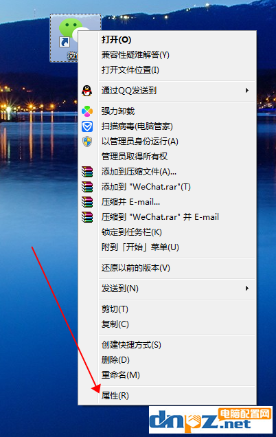

 
       2、在弹出的窗口中点击“打开文件位置”，如下图
 

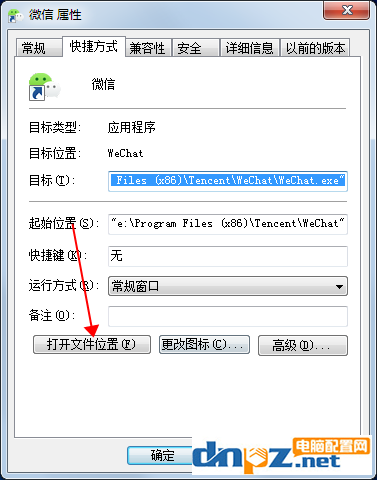

 
       3、此时你的电脑版微信安装目录就已经打开了，如下图：
 

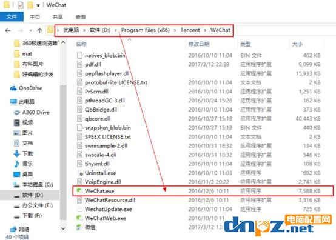

 
       4、此时你需要记住三个信息：安装盘、安装目录、微信执行文件名，比如我的这三个信息如下：
 
       ①、D盘
       ②、安装目录：Program Files (x86)\Tencent\WeChat
       ③、WeChat.exe
 
       5、点击电脑的开始图标，搜索“cmd”右键“命令提示符”以管理员方式运行，如下图
 

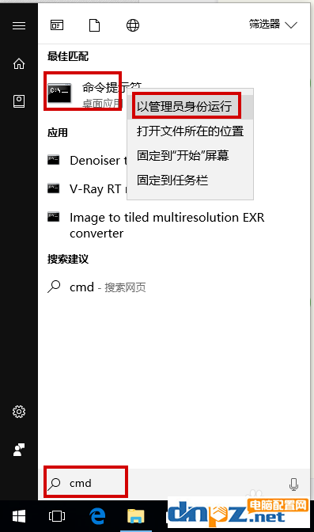

 
       6、根据步骤4中获得盘符信息我们在命令里输入“D:”点击回车进入D盘
 

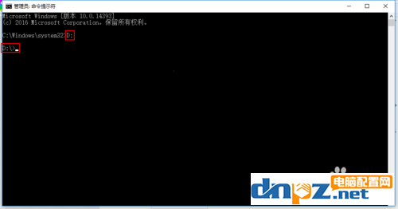

 
       7、进入D盘之后输入“cd 安装目录”进入我们微信的安装目录，例如我的“cd Program Files (x86)\Tencent\WeChat”（注：cd后边有一个空格），输入完成后按回车键。
 

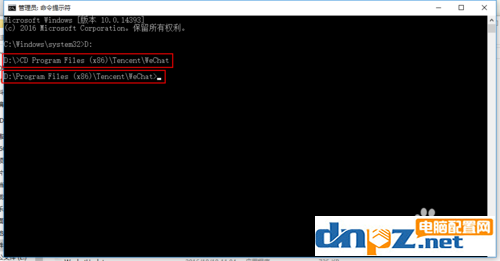

 
       8、然后接着输入“start 微信文件名” 例如我的是WeChat.exe所以我应该输入“start WeChat.exe”
 
       如果我们需要打开两个微信则输入“start WeChat.exe&WeChat.exe”
 
       以此类推三个则为“start WeChat.exe&WeChat.exe&WeChat.exe”输入完毕点击回车（打开数量跟电脑配置有关系一般三四个都没问题）
 

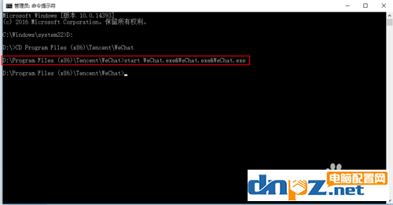

 
       9、移动微信窗口，这时我们就能看到多开后的电脑微信窗口了，如下图

 
 ## 电脑版微信多开方法二：此方法使用起来比第一种更方便（亲测有效）
 
       1、在空白处单击右键，新建→文本文档（俗称“记事本”）
 

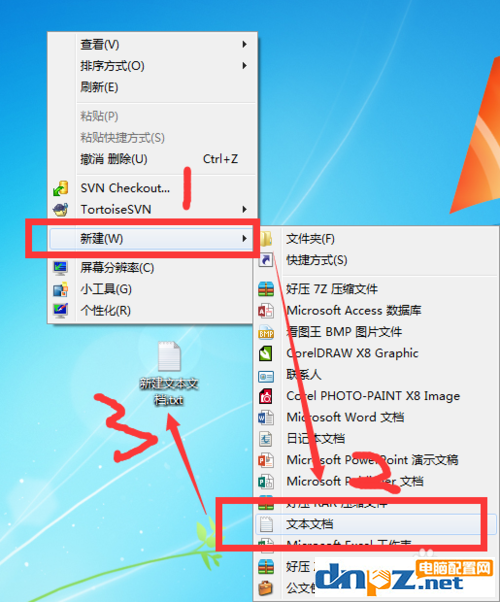

 
       2、双击打开新建好的“文本文档”
 

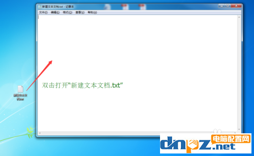

 
       3、查看微信安装路径：选择微信程序快捷方式→单击右键→属性；如图，快捷方式在桌面的，在开始菜单的都是右键
 

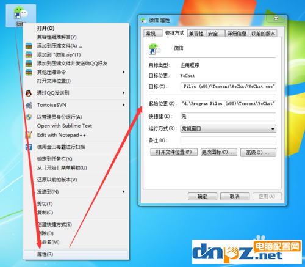

 

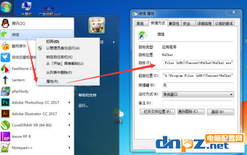

 
       4、输入以下代码（其中“D:\Program Files (x86)\Tencent\WeChat\”为微信安装路径，一个start就打开一个微信，两个start就打开两个微信，同理类推，打开N个微信就N个start）：
 
@echo off
start /d "D:\Program Files (x86)\Tencent\WeChat\" WeChat.exe
start /d "D:\Program Files (x86)\Tencent\WeChat\" WeChat.exe
exit
 

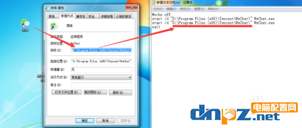

 
       5、接着：点击左上角“文件（F）”→“另存为（A）...”→文件名命名为：wechat.bat→保存类型改为：所有文件（*.*）→保存→保存到桌面（或者其他你想保存的位置）
 

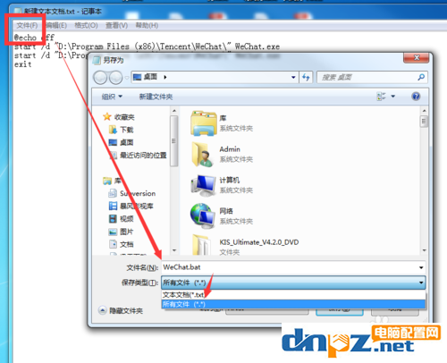

 
       6、然后在桌面双击打开“wechat.bat”→稍等片刻就出现微信登录界面了，目测只有一个界面，用鼠标移开后就发现有两个啦，如下图。

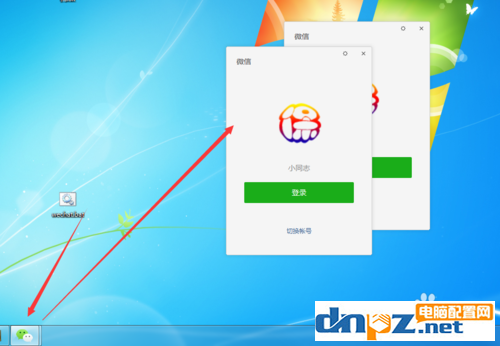

 
       以上两种电脑版微信多开方法都是经过本人测试的，真实有效，而且不需要任何多开器，多开软件之类的。个别电脑基础差的同学可能需要注意你的微信安装目录，不要完全复制本文中的命令，因为你电脑上的微信安装目录可能会本教程中的不同，如果本方法失效或者有什么问题，都可以到文章下方评论区留言。